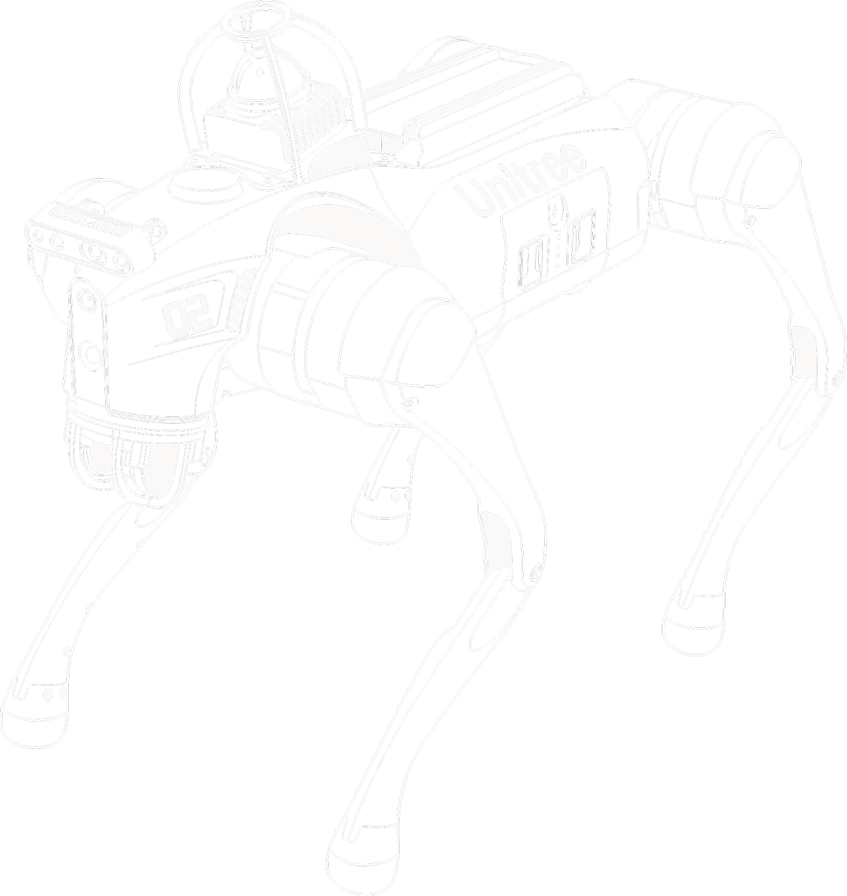

<!--  

 -->

<table>
  <tr>
    <td style="vertical-align: top; text-align: left;">
      RoboStore provides innovative robotic solutions for consumer, educational, and industrial applications.  
      Our products include legged robots, humanoid robots, manipulators, and essential components such as  
      motors, controllers, and LIDAR sensors. We focus on in-house research and development, advancing  
      technologies in perception and motion control. Through our GitHub and  
      <a href="https://www.robostore.com" target="_blank">RoboStore.com</a>, we offer open-source projects,  
      resources, and support to foster growth in robotics and automation.
    </td>
    <td style="vertical-align: top;">
      
    </td>
  </tr>
</table>

### 🌐 Connect With Us

---

    

        📚 Table of Contents (Click to Expand)
    

---

### 🔗 **Documentation Links**
| Link | Description |
|------|-------------|
| [About Us](docs/about.md) | Learn more about RoboStore and its mission. |
| [FAQs](docs/faq.md) | Frequently asked questions and their answers. |
| [User Guide](docs/user_guide.md) | Step-by-step guide for using our robotics products. |
| [Installation Guide](docs/installation_guide.md) | Instructions to install and set up the robots. |
| [Troubleshooting](docs/troubleshooting.md) | Common issues and how to resolve them. |
| [Repair and Maintenance](docs/repair_maintenance.md) | Maintenance and repair procedures. |
| [News and Updates](docs/news.md) | Latest news and product updates. |
| [Privacy Policy](docs/policies/privacy_policy.md) | Information on how we handle your data. |
| [Terms of Service](docs/policies/terms_of_service.md) | Terms and conditions for using RoboStore products. |
| [Shipping and Refund Policy](docs/policies/shipping_refund.md) | Shipping procedures and refund policies. |

---

---

<h2 style="margin: 0; font-size: 28px; font-weight: bold;"> Open Source Projects</h2>

<table align="center" border="1" width="100%">
    <tr style="background-color:#f2f2f2; font-weight:bold; text-align:center;">
        <th style="background-color:#e68a00;">Category</th>
        <th style="background-color:#58A4B0;">Project</th>
    </tr>
    <!-- Robot SDK -->
    <tr>
        <td rowspan="7" align="center" style="font-weight:bold; color:#e68a00; ">🛠️ Robot SDK</td>
        <td>
            <a href="https://github.com/unitreerobotics/unitree_legged_sdk" target="_blank">
                unitree_legged_sdk
            </a>  
            SDK tools for controlling robots.
        </td>
    </tr>
    <tr>
        <td>
            <a href="https://github.com/unitreerobotics/unitree_sdk2" target="_blank">
                unitree_sdk2
            </a>  
            Unitree robot SDK version 2.
        </td>
    </tr>
    <tr>
        <td>
            <a href="https://github.com/unitreerobotics/unitree_sdk2_python" target="_blank">
                unitree_sdk2_python
            </a>  
            Python interface for Unitree SDK2.
        </td>
    </tr>
    <tr>
        <td>
            <a href="https://github.com/unitreerobotics/unitree_actuator_sdk" target="_blank">
                unitree_actuator_sdk
            </a>  
            SDK for Unitree actuators.
        </td>
    </tr>
    <tr>
        <td>
            <a href="https://github.com/unitreerobotics/unilidar_sdk2" target="_blank">
                unilidar_sdk2
            </a>  
            SDK for Unitree Lidar L2.
        </td>
    </tr>
    <tr>
        <td>
            <a href="https://github.com/abizovnuralem/go2_ros2_sdk" target="_blank">
                go2_ros2_sdk (Unofficial)
            </a>  
            Unofficial ROS2 SDK for GO2 robots.
        </td>
    </tr>
    <tr>
        <td>
            <a href="https://github.com/legion1581/go2_python_sdk" target="_blank">
                go2_python_sdk (Unofficial)
            </a>  
            Unofficial Python SDK for GO2 robots.
        </td>
    </tr>
    <!-- Simulation Tools -->
    <tr>
        <td rowspan="5" align="center" style="font-weight:bold; color:#0073e6;">🔬 Simulation Tools</td>
        <td>
            <a href="https://github.com/unitreerobotics/unitree_ros" target="_blank">
                unitree_ros
            </a>  
            ROS simulation package with URDF files for Unitree series robots.
        </td>
    </tr>
    <tr>
        <td>
            <a href="https://github.com/unitreerobotics/unitree_ros2" target="_blank">
                unitree_ros2
            </a>  
            ROS2 package for simulating B2 and Go2 robots with ROS2 environments.
        </td>
    </tr>
    <tr>
        <td>
            <a href="https://github.com/unitreerobotics/unitree_mujoco" target="_blank">
                unitree_mujoco
            </a>  
            Simulation tool with sim-to-real implementations using MuJoCo.
        </td>
    </tr>
    <tr>
        <td>
            <a href="https://github.com/unitreerobotics/z1_ros" target="_blank">
                z1_ros
            </a>  
            ROS package for simulating Z1 robots.
        </td>
    </tr>
    <tr>
        <td>
            <a href="https://github.com/abizovnuralem/go2_omniverse" target="_blank">
                go2_omniverse (Unofficial)
            </a>  
            GO2 and G1 integration with NVIDIA Isaac Sim.
        </td>
    </tr>
    <!-- Manipulation Tools -->
    <tr>
        <td rowspan="4" align="center" style="font-weight:bold; color:#009933;">🤖 Manipulation</td>
        <td>
            <a href="https://github.com/unitreerobotics/avp_teleoperate" target="_blank">
                avp_teleoperate
            </a>  
            Apple Vision Pro interface for teleoperating Unitree robots.
        </td>
    </tr>
    <tr>
        <td>
            <a href="https://github.com/unitreerobotics/kinect_teleoperate" target="_blank">
                kinect_teleoperate
            </a>  
            Teleoperation using Azure Kinect DK camera for H1 robots.
        </td>
    </tr>
    <tr>
        <td>
            <a href="https://github.com/unitreerobotics/app_teleoperate" target="_blank">
                app_teleoperate
            </a>  
            Mobile app for teleoperating Unitree robots.
        </td>
    </tr>
    <tr>
        <td>
            <a href="https://github.com/unitreerobotics/unitree_IL_lerobot" target="_blank">
                unitree_IL_lerobot
            </a>  
            Framework for training and testing data collected from Unitree robots.
        </td>
    </tr>
    <!-- Learning & Control Algorithms -->
    <tr>
        <td rowspan="3" align="center" style="font-weight:bold; color:#993399;">📚 Learning & Control</td>
        <td>
            <a href="https://github.com/unitreerobotics/unitree_rl_gym" target="_blank">
                unitree_rl_gym
            </a>  
            Reinforcement learning examples for Go2, H1, H1_2, and G1 Unitree robots.
        </td>
    </tr>
    <tr>
        <td>
            <a href="https://github.com/unitreerobotics/unitree_guide" target="_blank">
                unitree_guide
            </a>  
            Demonstration of robot joint motor control and force control algorithms.
        </td>
    </tr>
    <tr>
        <td>
            <a href="https://github.com/unitreerobotics/point_lio_unilidar" target="_blank">
                point_lio_unilidar
            </a>  
            SLAM system for Lidar-based inertial odometry using Point-LIO.
        </td>
    </tr>
    <!-- Miscellaneous Projects -->
    <tr>
        <td rowspan="3" align="center" style="font-weight:bold; color:#cc6600;">🔧 Miscellaneous</td>
        <td>
            <a href="https://github.com/unitreerobotics/unitree_model" target="_blank">
                unitree_model
            </a>  
            Robot 3D models and URDF files for different simulation environments.
        </td>
    </tr>
    <tr>
        <td>
            <a href="https://github.com/unitreerobotics/unitree_control_panel" target="_blank">
                unitree_control_panel
            </a>  
            User control panel for managing Unitree robot operations.
        </td>
    </tr>
    <tr>
        <td>
            <a href="https://github.com/unitreerobotics/unitree_ros_to_real" target="_blank">
                unitree_ros_to_real
            </a>  
            Interface for controlling real robots from ROS.
        </td>
    </tr>
</table>

---

<h3 align="center">📦 Installation and Setup</h3>

 **Hardware Setup**  
  Learn how to assemble and configure your robot's physical components.

 **Software Setup**  
  Guide to installing and configuring the necessary software and drivers.

---

<h3 align="center">💻 Usage and Programming</h3>

 **Programming Your Robot**  
  Explore programming interfaces and examples to get your robot running with custom tasks.

 **Usage Instructions**  
  Step-by-step instructions to control and operate the robot's functions effectively.

---

<h3 align="center">🔍 Troubleshooting & Support</h3>

 **Common Issues**  
  Quickly diagnose and resolve common hardware and software issues.

 **Support**  
  Access RoboStore's dedicated support team and resources for further assistance.

---

