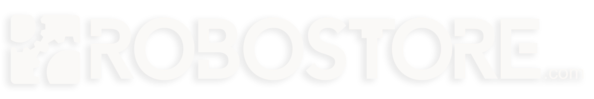

<h2 style="font-weight: bold; text-align: left;">
   🚀 RoboStore FAQ
</h2>

Welcome to the **RoboStore FAQ**! Here, we answer common questions about our products, services, and robotic solutions.  

---

##  General Questions  

  
🤖 What is RoboStore?

  RoboStore is the **official U.S. distributor of Unitree Robotics**, bringing cutting-edge robotic solutions to the U.S. market.

  
🛒 What products do we offer?

  We provide the full line of **Unitree Robotics products**, including:
  - **GO2 Series** – AI-powered quadrupeds.
  - **G1 Humanoid** – Research & industrial humanoid robot.
  - **Accessories** – LiDAR, manipulators, batteries, and more.

  
🯠Who benefits from our robots?

  RoboStore serves:
  - **Educators** – Hands-on STEM robotics.
  - **Industrial Engineers** – Advanced automation solutions.
  - **Enthusiasts & Developers** – R&D and AI applications.

---

##  GO2 Quadrupeds  

  
🚀 What versions of the GO2 do we offer?

  | **Model** | **Key Feature** | **Best Use Case** |
  |-----------|---------------|----------------|
  | **GO2 Air** | Entry-level | Hobbyists & Learning |
  | **GO2 Pro** | AI-enhanced mobility | Advanced robotics |
  | **GO2 Edu** | High-performance AI | Research & AI applications |
  | **GO2 Edu 40 Tops** | AI-optimized | Complex industrial tasks |
  | **GO2 Edu 100 Tops** | Cutting-edge AI | High-end research |
  | **GO2-W** | Wheeled version | Specialized environments |

  
🔠What are the GO2’s key features?

  - **Advanced Gait Capabilities** – Walking, rolling over, climbing.
  - **3D LiDAR Mapping** – Precision navigation.
  - **Intelligent Side-Follow System 2.0** – AI-enhanced movement.
  - **Over-the-Air (OTA) Updates** – Continuous improvements.

---

## G1 Humanoids  

  
🔧 What versions of the G1 are available?

  | **Model** | **Best For** | **Key Feature** |
  |-----------|------------|----------------|
  | **G1 Base** | R&D | AI-driven mobility |
  | **G1 EDU** | Education & Research | Expanded sensor package |

  
📌 What are the G1’s key features?

  - **Mobility** – Walks, jumps, climbs stairs.
  - **Dexterity** – Can manipulate objects with three-fingered hands.
  - **Vision** – LiDAR, depth cameras, AI-powered recognition.

---

## Technical Support & Resources  

  
🔧 What kind of support does RoboStore offer?

  - **Hardware Support** – Assistance with procurement.  
  - **Software Guidance** – Troubleshooting & setup.  
  - **Educational Resources** – Video tutorials & documentation.  
  - **GitHub** – Open-source SDKs & project files.  

---

## 📞 Need More Help?  
For further support, visit our [**GitHub Repository**](https://github.com/robostore) or contact us at **sales@robostore.com**.

---
